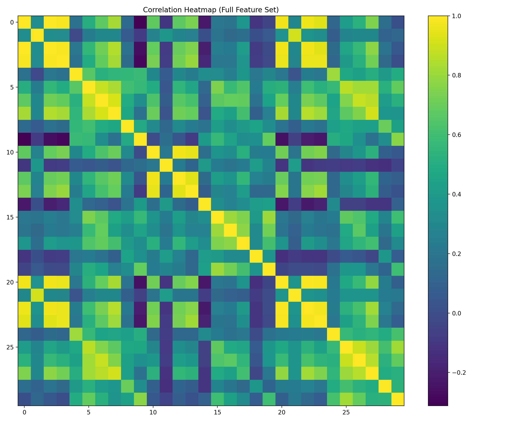
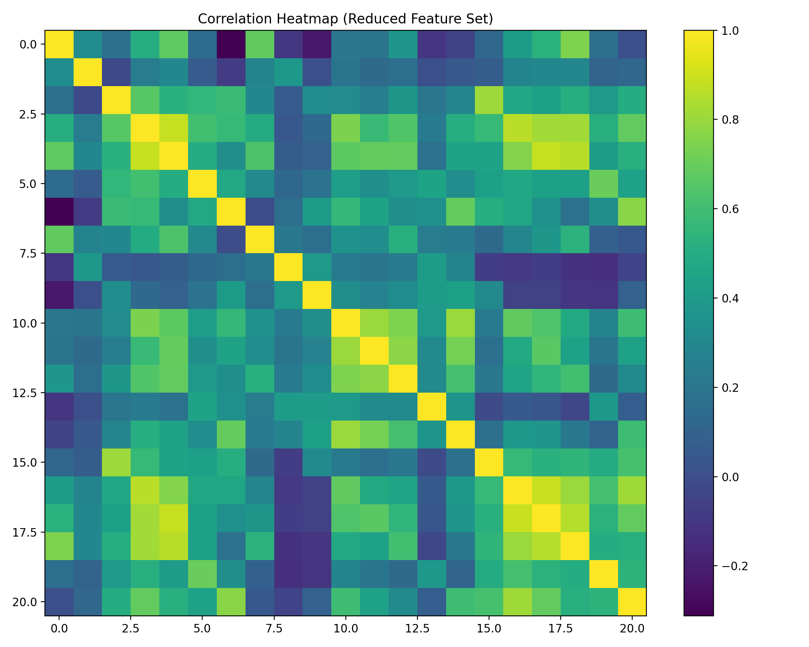
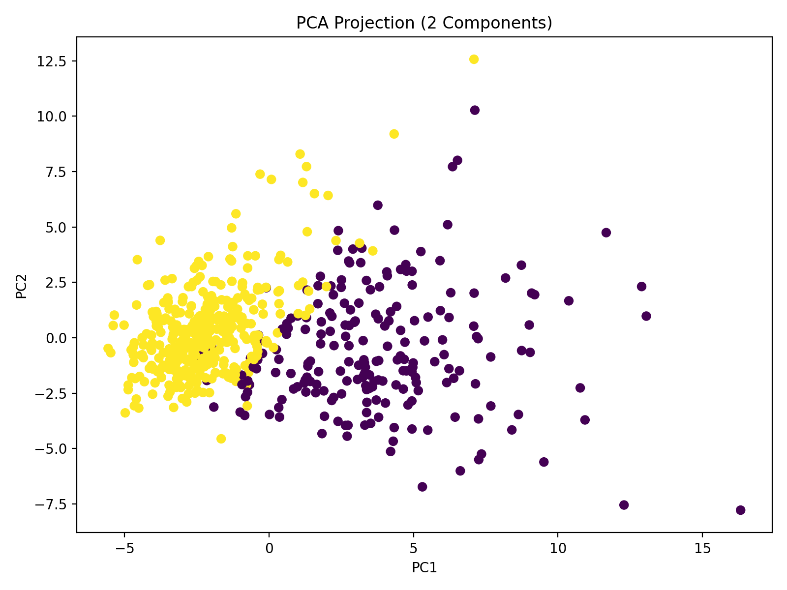
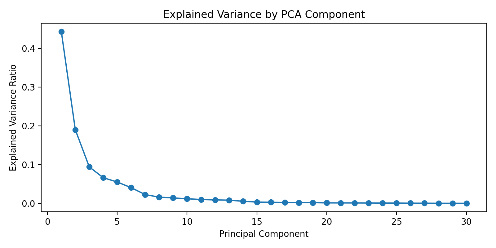

# Advanced Medical Data Analysis - Breast Cancer Dataset

## Overview
This project extends basic exploratory data analysis by applying more advanced analytical techniques to a public medical dataset. The focus is on understanding feature relationships, redundancy, and dimensionality in preparation for future modeling. 

Rather than building predictive models, this analysis emphasizes reasoning, interpretation, and responsible handling of medical data.

## Dataset
- Source: Breast Cancer Wisconsin (Diagnostic) dataset
- Observations: 569 samples
- Features: 30 numerical measurements derived from digitized images of breast masses
- Target: Tumor diagnosis (0 = malignant, 1 = benign)

## Methods
The analysis includes:
- Correlation analysis to identify redundant features
- Visualization using correlation heatmaps
- Feature reduction based on high correlation thresholds
- Principal Component Analysis (PCA) for dimensionality reduction
- Interpretation of variance and data structure

## Key Findings
- Many size and shape-related features are highly correlated, indicating redundancy.
- Reducing correlated features simplifies the dataset without losing essential structure.
- PCA shows that a smaller number of components captures a meaningful portion of variance.
- The dataset contains clear structure that supports future, interpretable modeling approaches.

## Visulisations
### Correlation Analysis

### PCA

## Project Scope
This project focuses on analysis and understanding, not prediction.
Machine learning models and evaluation are intentionally left for a future project.

## Disclaimer
This project is for educational purposes only and is not intended for clinical or diagnostic use.